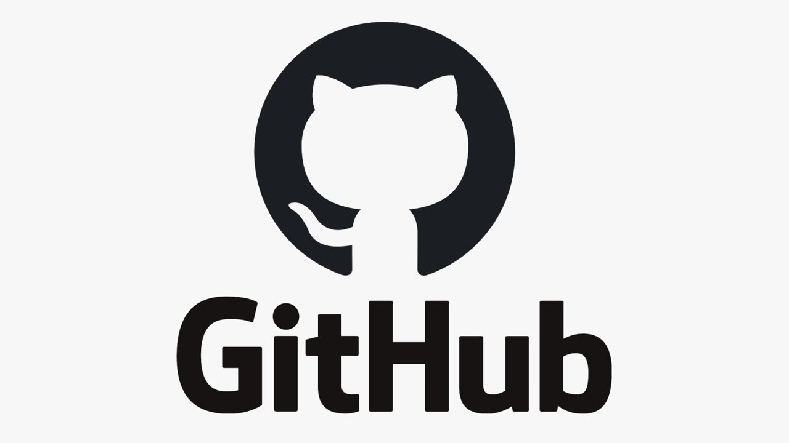
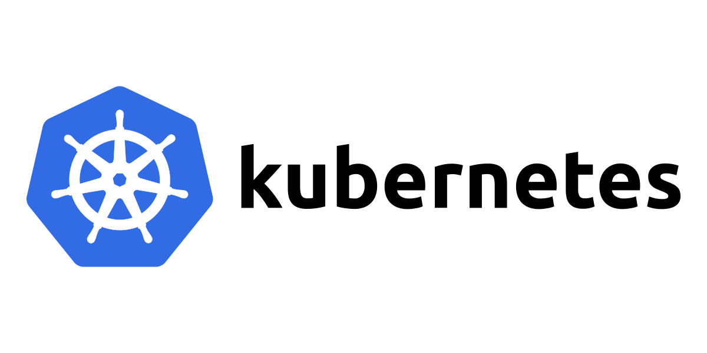
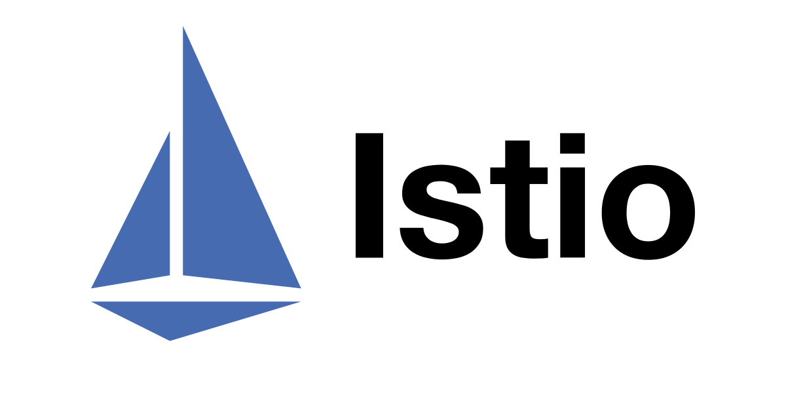
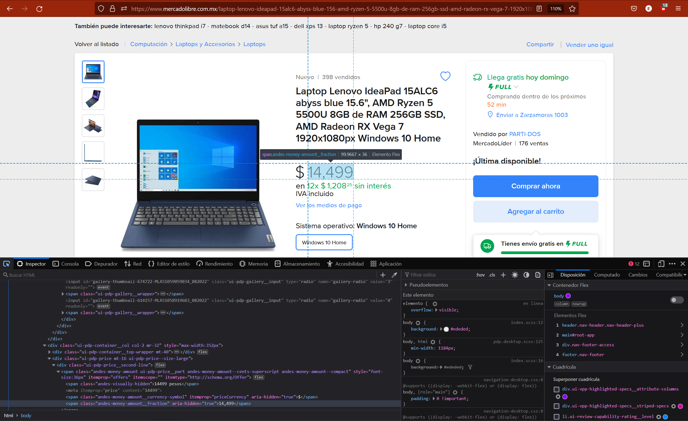
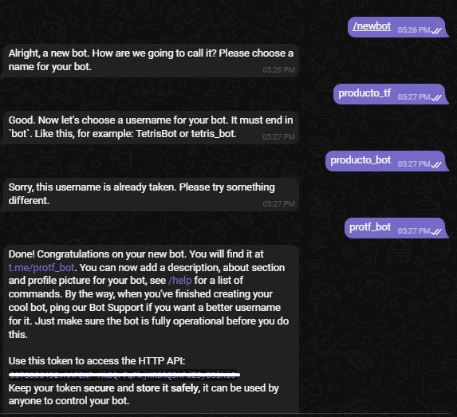
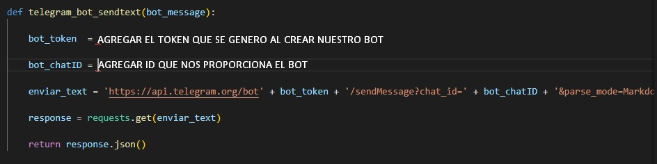

# Tolerancia Fallas
Este proyecto trata de un BOT que se gestiona por medio de una API de Telegram, todo por medio de de un mismo CHAT de telegram y tener una escalabilidad para al mmismo
y tolerancia a fallas, algunas de las herramientas que se utilizamos fueron Docker, Kubernetes, Istio y por supuesto GitHub.

# Introducción
 Para este proyecto usamos algunas herramientas que aprendimos en nuestro curso de tolerancia a fallas, e implementamos una herrmientas que que descubrimos durante el curso la cual es el <strong>WebScraping</strong> esta es una librería que podemos encontrar en el lenguaje de programación de <i><strong>Python</strong></i>, es una técnica que sirve para extraer información de uno o varios sitios webs de terceros.
 Tambien hacemos uso de una API de telegram que nos permite enlazar enviar notifacaciones al usuario en cuestión. Todo esto por supuesto escalandolo a contenedores,  llevandolo a otros servidores y a monitoriar el trafico entre ellos.
# Requerimientos
 ###Principales herramientas utilizadas para este proyecto

####linea de codigo

* $ pip install BeautifulSoup
* $ pip install webbrowser
* $ pip install requests

###¿Como funcionan estas herramientas?

*1.- BeautifulSoup*

Beautiful Soup es una librería Python que permite extraer información de contenido en formato HTML o XML. Para usarla, es necesario especificar un parser, que es responsable de transformar un documento HTML o XML en un árbol complejo de objetos Python.

*2.- Webbrowser*

Proporciona una interfaz de alto nivel que permite mostrar documentos basados en web a los usuarios. En la mayoría de circunstancias, simplemente llamar a la función open() desde este módulo hará lo correcto.

*3.- request*

Es una biblioteca HTTP para el lenguaje de programación Python. El
objetivo del proyecto es hacer que las solicitudes HTTP sean más simples y
amigables para los humanos.

###¿Como se espera escalar?

Se planea crear un bot en telegram en el cual mediante un botón de “start” nos permitirá realizar la consulta sin tener que compilarlo desde el editor, el cual nos brinda un token en la consulta para validar la identificación del usuario.

*Telegram*: Utilizamos telegram por la gran cantidad de herramientas que nos proporciona de manera fácil, de igual manera se planea poder escalar a Whatsapp en un futuro ya que como sabemos es la app más frecuentemente utilizada.

*BothFather*: Interactuar con BotFather consiste en intercambiar mensajes. Dale a“Start” y te aparecerán una serie de comandos. Cada uno te servirá para personalizar tu bot al máximo. Vamos a crear el bot ejecutando el comando /newbot o dando clic a dicho comando.

# Pasos principales para la realizacion del proyecto
 ## Web Scraping
 En primera instancia lo que hacemos es conseguir los datos de la página web para poder trabajas con ellos, en este caso solo con el dato que requierimos el cual es el precio del producto, es muy sencillo el generar la lectura en este caso para el programa solo es necesario identificar un objeto, para este caso es necesario indicar al programa cual objeto de <i>HTML</i> es el que nos interesa. 

 

De este aparta obtendremos mas que nada el bloque donde se almacena el precio del producto, ya que es la unica instacia que ocupamos para saber si el precio bajo de valor o no.

 ## Configuracion del bot-telegram

En este aparatado configuramos nuestro bot con los datos y valores unicos que nos brinda esta herramienta una ves creada.

 Lo principal que obtendremos de este aparatado es:

 - Token
 - Id  (identificador)

Una ves obtenido este apartado lo agregaremos en la parte del codigo correspondiente, esto mas que nada para enlazar tanto el codigo ejecutable del VSCode y el bot de telegram.

 
